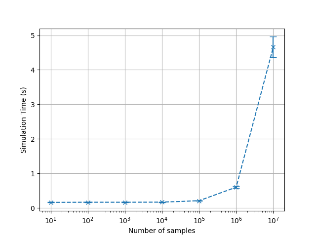
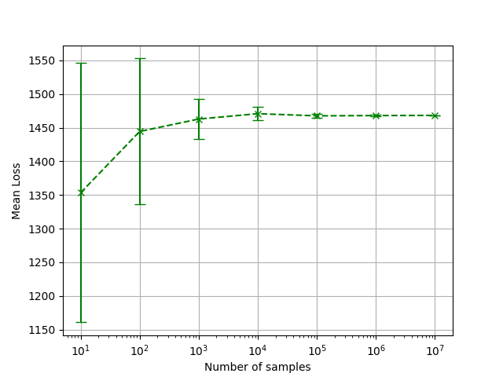

# Hurricane Loss Model

A simple command line utility that runs a model of hurricane losses and
calculates the expected annual economic loss in Florida and the Gulf states.

## Installation

### Basic Installation

Clone into this repository and run the following in the root of the project:

```
pip install .
```

I recommend using a virtual environment to install this package to avoid
dependency conflicts. For the recommended installation route follow the
[Development Installation](###development-installation).

### Development Installation

This package depends on `poetry` for its dependency management.
To install the package first follow the instructions to install
[poetry](https://python-poetry.org/docs/).

Then to install from the source clone this repository and run `poetry install`
from the root of the project.

## Usage

Poetry sets up a separate virtual environment to set up the project and the
command line utility. The easiest way to interact with the utility is to open up
a shell in the virtual environment by running `poetry shell` in this package.

The command line utility can then be used as follows:

```
gethurricaneloss [options] florida_landfall_rate florida_mean florida_stddev gulf_landfall_rate gulf_mean gulf_stddev
```
The command line arguments are defined as below:

* `florida_landfall_rate` - The annual rate of landfalling hurricanes in Florida.
* `florida_mean`, `florida_stddev` - The mean and standard deviation of
  economic loss distribution of a landfalling hurricane in Florida.
* `gulf_landfall_rate` - The annual rate of landfalling hurricanes in the Gulf
  states.
* `gulf_mean`, `gulf_stddev` - The mean and standard deviation of economic loss
  distribution of a landfalling hurricane in Gulf states.

The optional parameters are:

* `-n`, `--num_monte_carlo`- Number of samples (simulation years) to run (default 1000).

## Code Efficiency

To test the efficency of this code we run an experiment running the CLI for
different values of `num_monte_carlo` with the same input. The script for
collecting this data and plotting can be found in `scripts/efficency.py`.

Looking at the mean time per run (averaged over 10 runs) produces the following
result:



Note the error bars correspond to 1 standard deviation. The code is able to run
with $10^7$ samples in under 5 seconds.

This number of samples is enough for the Monte Carlo simulation to stabilise.
Plotting the standard deviation of the output below, we see the mean loss
stabilises around $10^5$ samples for this input.


